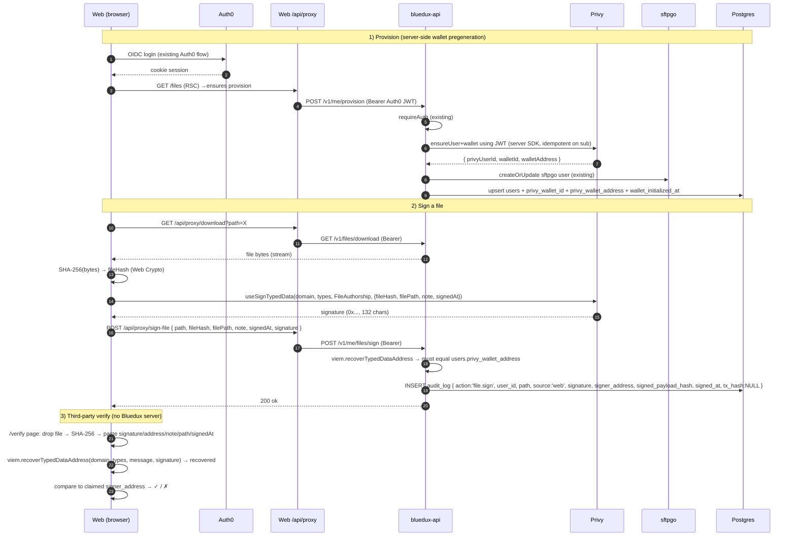

# Plan · Phase 1 Proof of Authorship — Privy 钱包 + EIP-712 文件签名

## Context

Bluedux 当前的能力是"用 Auth0 登录,文件存进 sftpgo,audit_log 记 sftpgo webhook"——文件没有任何加密身份。Phase 1 要给每个用户加上一个**不可伪造的作者签名**:每个 Bluedux 用户在 provision 时自动获得一个 user-controlled Privy embedded wallet,web 端可对自己的文件做 EIP-712 签名,签名+地址进 audit_log,任何持有该文件 + 签名的第三方都能在客户端独立用 viem 验证(完全不依赖 Bluedux server)。

为什么 Privy:embedded wallet 非托管 + 内置 export UI + 支持 custom JWT(直接信任 Auth0 token,用户不用感知"另一个登录")+ 内置 EIP-712 typed data 签名 + 同一个 JWT subject 永远映射同一个 wallet(满足 admin 删用户后再 provision 拿回原 wallet 的硬要求)。

---

## Trust contract(本期不可变更——改任何一项作废所有历史签名)

| 项 | 值 |
|---|---|
| 签名链 | user 自己的 Privy embedded wallet,**非** server signer |
| Auth 桥 | Privy custom JWT,signing source = Auth0 access token (`aud=https://api.bluedux.com`),subject = `auth0_sub` |
| Hash 算法 | SHA-256(file content),输出 `bytes32`,十六进制带 `0x` 前缀 |
| EIP-712 domain | `{ name: "Bluedux", version: "1", chainId: 8453 }` (Base) |
| EIP-712 primary type | `FileAuthorship` |
| EIP-712 message | `{ fileHash: bytes32, filePath: string, note: string, signedAt: uint256 }` |
| Idempotency key | `auth0_sub`(Privy 自身用 JWT subject 持久化 user + wallet,Bluedux DB 删用户**不**触发 Privy 删除) |
| `audit_log.tx_hash` | Phase 1 全 NULL,预留 Phase 2/3 |

`note` 允许空字符串。`filePath` 是签名时刻 sftpgo 上的绝对路径(server 端**不可**做规范化,client 端发什么 server 存什么)。

---

## 架构流程



---

## 实施步骤

### Step 1 · DB migration

新文件:`packages/db/migrations/0001_add_proof_of_authorship.sql`(下一个 migration 序号,前面是 `0000_last_black_widow.sql`)

```sql
ALTER TABLE "users"
  ADD COLUMN "privy_wallet_id" varchar(64),
  ADD COLUMN "privy_wallet_address" varchar(42),
  ADD COLUMN "wallet_initialized_at" timestamp;

ALTER TABLE "users"
  ADD CONSTRAINT "users_privy_wallet_address_unique" UNIQUE ("privy_wallet_address");

ALTER TABLE "audit_log"
  ADD COLUMN "signature" text,
  ADD COLUMN "signer_address" varchar(42),
  ADD COLUMN "signed_payload_hash" varchar(66),
  ADD COLUMN "signed_at" timestamp,
  ADD COLUMN "tx_hash" varchar(66);

CREATE INDEX "audit_log_signer_address_idx" ON "audit_log"("signer_address") WHERE "signer_address" IS NOT NULL;
```

同步 `packages/db/src/schema.ts`:
- `users` 加三列(`privyWalletId`,`privyWalletAddress`,`walletInitializedAt`),后两列分别 unique / 普通
- `auditLog` 加五列(`signature` text,`signerAddress` varchar 42,`signedPayloadHash` varchar 66,`signedAt` timestamp,`txHash` varchar 66)
- 重新 `pnpm --filter @bluedux/db drizzle:generate` 生成 migration(也可以手写 `.sql` 然后只改 schema.ts,二选一)
- 重新导出 `User`/`AuditLogEntry` 类型自动包含新字段

### Step 2 · 新 shared package `packages/proof-of-authorship`

EIP-712 类型 + verify helper 是**信任契约**,只能存在于 ONE place。建一个新的 workspace package,api 和 web 都从这里导入。

`packages/proof-of-authorship/`:
- `package.json` —— `name: "@bluedux/proof-of-authorship"`,`main`/`module` 指向 `dist/`
- `tsup.config.ts` —— 与 `packages/sftpgo-client` 同型
- `src/index.ts`:
  ```typescript
  import { recoverTypedDataAddress, type Hex } from 'viem'

  export const EIP712_DOMAIN = {
    name: 'Bluedux',
    version: '1',
    chainId: 8453, // Base — Phase 1 锁定,不再改
  } as const

  export const EIP712_TYPES = {
    FileAuthorship: [
      { name: 'fileHash', type: 'bytes32' },
      { name: 'filePath', type: 'string' },
      { name: 'note',     type: 'string' },
      { name: 'signedAt', type: 'uint256' },
    ],
  } as const

  export const PRIMARY_TYPE = 'FileAuthorship' as const

  export type FileAuthorshipMessage = {
    fileHash: Hex
    filePath: string
    note: string
    signedAt: bigint
  }

  export async function recoverFileAuthor(
    message: FileAuthorshipMessage,
    signature: Hex,
  ): Promise<Hex> {
    return recoverTypedDataAddress({
      domain: EIP712_DOMAIN,
      types: EIP712_TYPES,
      primaryType: PRIMARY_TYPE,
      message,
      signature,
    })
  }
  ```

`pnpm-workspace.yaml` 已经包含 `packages/*`,无需改动。

### Step 3 · Privy dashboard 一次性配置(用户操作)

1. https://dashboard.privy.io → 创建 app `Bluedux`
2. **User management → Authentication → Third-party auth → Add provider**
   - JWKS URL: `https://bluedux.us.auth0.com/.well-known/jwks.json`
   - Subject claim: `sub`
   - Audience: `https://api.bluedux.com`(可选;增加一层防护)
3. **Embedded wallets** → Enable Ethereum,**Default chain** = Base (8453),Create on login = `users-without-wallets`(防御性兜底,server 端 ensureWallet 失败时 client 端首次 mount 自动建)
4. 取得 `App ID` + `App Secret`(写进 `auth0.md`,gitignored)

### Step 4 · 服务端改动 (apps/api/)

**新依赖** (`apps/api/package.json`):
- `@privy-io/server-auth`(server SDK,2026-04 当前包名;若 npm 上是 `@privy-io/node` 以实际为准)
- `viem`
- `@bluedux/proof-of-authorship`(workspace 引用)

**新环境变量** (`apps/api/src/env.ts` + Railway):
- `PRIVY_APP_ID`
- `PRIVY_APP_SECRET`

**新文件** `apps/api/src/lib/privy.ts`:
- 实例化 `PrivyClient`
- `ensureWallet(rawJwt: string, sub: string): Promise<{ id, address }>`:
  1. 用 `rawJwt` 让 Privy 解析 + 找/建 Privy user(custom auth API,SDK 通常叫 `getUserByCustomAuthIdentityToken` / `verifyAuthToken` —— 实施时按 SDK 当前命名)
  2. 检查 user 已有 embedded ethereum wallet → 有就返回
  3. 没有 → `wallets.create({ chain_type:'ethereum', owner: { user_id: privyUserId } })`
  4. 返回 `{ id, address }`
- 函数对 `sub` 幂等(Privy 自己的 user 模型保证)

**修改** `apps/api/src/routes/me.ts` `POST /v1/me/provision`:
- 在 sftpgo create/update 之后、users upsert 之前/之后(同一事务) 调 `ensureWallet(c.var.user.rawToken, c.var.user.sub)`
- upsert 时把 `privyWalletId / privyWalletAddress / walletInitializedAt` 写入(不存在时才写,已存在 → 不动)
- 响应里增加 `walletAddress` 字段

**新路由** `apps/api/src/routes/me.ts` `POST /v1/me/files/sign`(也可拆出 `routes/files.ts`,但 me.ts 还短,先合并):
- 入参 zod schema:`{ path: string, fileHash: string (0x + 64 hex), filePath: string, note: string, signedAt: number, signature: string (0x + 130 hex) }`
- 服务端**不**重新计算 hash —— 用户对自己浏览器拿到的 bytes 负责
- 业务校验:`filePath === path`(防 client 笔误);`signedAt` 在合理窗口内(允许 ±10 分钟时钟漂移)
- 用 `@bluedux/proof-of-authorship` 的 `recoverFileAuthor()` recover address
- 查 users 表拿 `privy_wallet_address` → 必须 case-insensitive 等于 recovered
- INSERT audit_log:`{ action:'file.sign', user_id, path, size:null, source:'web', ts:now(), signature, signer_address: <user wallet>, signed_payload_hash: fileHash, signed_at: new Date(signedAt*1000), tx_hash: null }`
- 返回 `{ ok:true, recordedAt:ts }`

**修改** `apps/api/src/routes/me.ts` `GET /v1/me`:
- 响应里追加 `walletAddress`(即 `users.privy_wallet_address`),供 web /settings/wallet 渲染

**不改**:
- `apps/api/src/middleware/auth.ts` audiences 数组(Privy 不通过 bluedux-api,直接验 Auth0 JWKS)
- `apps/api/src/routes/admin.ts` delete user 流程(**关键**:不能 call Privy delete,wallet 要在 Privy 侧持久化)

### Step 5 · Web 改动 (apps/web/)

**新依赖** (`apps/web/package.json`):
- `@privy-io/react-auth`
- `viem`
- `@bluedux/proof-of-authorship`

**新环境变量**:
- `NEXT_PUBLIC_PRIVY_APP_ID`(public,client SDK 用)

**新路由** `apps/web/app/api/auth/access-token/route.ts`:
- GET handler:`auth0.getSession()` → `auth0.getAccessToken()` → 返回 `{ token }`
- 无 session → 401(Privy SDK customAuth 会容错,视为 logged out)
- **风险**:把 Auth0 access token 暴露到浏览器 JS。对本应用,该 token 已是 web → bluedux-api 路径要用的同一个 token,不构成新的权限放大。但应在 README/fact 里写清楚。

**新路由** `apps/web/app/api/proxy/sign-file/route.ts`:
- 复用 upload/route.ts 的 Bearer 转发模板,POST 到 `/v1/me/files/sign`

**修改** `apps/web/app/layout.tsx`:
- 整树包一层 `<PrivyProvider appId={process.env.NEXT_PUBLIC_PRIVY_APP_ID!} config={{ defaultChain: base, supportedChains: [base], embeddedWallets: { createOnLogin: 'users-without-wallets' }, customAuth: { getCustomAccessToken } }}>`
- `getCustomAccessToken` 从 `/api/auth/access-token` 拉

**修改** `apps/web/app/files/FilesPanel.tsx`:
- 在每个文件行的 action cell(line 130 附近)加一个 `<button>Sign</button>`
- 点击 → 行下展开一个 inline panel:`<input placeholder="Note (optional)" />` + Sign / Cancel
- Sign 流程:
  1. `fetch('/api/proxy/download?path=' + ...)` → `arrayBuffer()`
  2. `crypto.subtle.digest('SHA-256', buf)` → `0x` + 64 hex(`bytes32`)
  3. `signedAt = Math.floor(Date.now()/1000)`
  4. `usePrivy().signTypedData({ domain: EIP712_DOMAIN, types: EIP712_TYPES, primaryType: 'FileAuthorship', message: { fileHash, filePath: childPath, note, signedAt: BigInt(signedAt) } })`
  5. POST `/api/proxy/sign-file` 全部字段
  6. 用现有 error/ok span 显示反馈,完毕 `router.refresh()`
- 文件 >100MB 时显示 "Hashing large file…" 进度条(简单 setState 即可,Web Crypto digest 单次 ArrayBuffer 没法 stream,300MB quota 内可以接受)

**新页面** `apps/web/app/settings/wallet/page.tsx`(server component):
- 类似 `/settings/ssh-key/page.tsx` —— `auth0.getSession()` + 调 `/v1/me` 拿 `walletAddress` → 传给 `WalletPanel`

**新组件** `apps/web/app/settings/wallet/WalletPanel.tsx`(client):
- 显示地址(monospace,带"复制"按钮)
- "Export private key" 按钮 → `useExportWallet().exportWallet()` 弹 Privy 跨 origin modal,用户在 modal 里看 + 复制 private key
- 不显示余额、不显示链、不显示 chain switcher —— Phase 1 只为签名服务
- 提示文案:"This wallet is non-custodial. Save the exported key in a secure place; without it you cannot recover signing power."

**修改** `apps/web/app/_components/Nav.tsx`:
- 加 `<Link href="/settings/wallet">Wallet</Link>`

**新页面** `apps/web/app/verify/page.tsx`(public,client component,**完全不依赖 Bluedux session/api**):
- 表单:
  - File picker(读 ArrayBuffer 算 SHA-256)
  - File path(text)
  - Note(text,允许空)
  - Signed at(unix seconds 或 ISO datetime)
  - Signature(textarea)
  - (可选)expected signer address —— 留空就只显示 recovered
- 按 Verify:浏览器内用 `@bluedux/proof-of-authorship` 的 `recoverFileAuthor` recover → 显示 `Recovered signer: 0x...` + 与 expected 比对结果
- 标语:"This page runs entirely in your browser. Bluedux servers are not involved. The cryptographic guarantee is independent of Bluedux."
- 可选展示一段 viem Node REPL 复刻代码(让纯命令行的人也能验证)

### Step 6 · 文档更新

- `fact.md`:
  - 顶级红线加第 5 条:**Phase 1 Proof of Authorship signing chain is locked at chainId 8453 + EIP-712 domain `{Bluedux,1,8453}` + primary type `FileAuthorship`**
  - 架构图加 Privy node:Web/API 都对接 Privy,Privy 验 Auth0 JWKS
  - 分册索引加 `fact/wallet.md` 一行
- `fact/env.md`:加 `PRIVY_APP_ID/PRIVY_APP_SECRET`(api)、`NEXT_PUBLIC_PRIVY_APP_ID`(web)
- `fact/auth0.md`:加 "Privy third-party auth registration" 一节(Privy 把 Auth0 JWKS 当 trusted JWT issuer)
- `fact/flows.md`:加 "File signing flow" + "Verification flow"
- `fact/gotchas.md`:加
  - **chainId/EIP-712 domain/types 一旦上线就锁死,改任何字段作废所有历史签名**
  - **Admin delete 不可调 Privy 删除 API**(idempotency 依赖 Privy 持久化 user-by-sub)
  - **File hash 在浏览器里算**(用 Web Crypto `crypto.subtle.digest`),server 不重算 —— 这样用户对自己拿到的 bytes 签名,server 篡改无法替换
  - **chainId 8453 (Base) 是 Phase 1 决议**,Phase 2 的 BLDX 也部署在 Base 上
- `fact/checklist.md`:在末尾加 5 条(对应下面 Verification 章节)
- 新建 `fact/wallet.md`:Privy app 配置截图清单 / 文件签名 EIP-712 详细 schema / 第三方 verify 代码片段

---

## Critical files

| 路径 | 改动类型 | 改动 |
|---|---|---|
| `packages/db/migrations/0001_add_proof_of_authorship.sql` | NEW | users + audit_log 列 |
| `packages/db/src/schema.ts` | MOD | 与 migration 同步 |
| `packages/proof-of-authorship/` (所有文件) | NEW | shared EIP-712 trust contract + recover helper |
| `pnpm-workspace.yaml` | (no change) | `packages/*` 已涵盖 |
| `apps/api/package.json` | MOD | + @privy-io/server-auth, viem, @bluedux/proof-of-authorship |
| `apps/api/src/env.ts` | MOD | + PRIVY_APP_ID/SECRET |
| `apps/api/src/lib/privy.ts` | NEW | ensureWallet helper |
| `apps/api/src/routes/me.ts` | MOD | provision 集成 ensureWallet;新 POST /files/sign;GET /me 增 walletAddress |
| `apps/api/src/routes/admin.ts` | (no change) | 严禁动 Privy delete |
| `apps/api/src/middleware/auth.ts` | (no change) | audiences 数组保持原样 |
| `apps/web/package.json` | MOD | + @privy-io/react-auth, viem, @bluedux/proof-of-authorship |
| `apps/web/app/layout.tsx` | MOD | wrap PrivyProvider |
| `apps/web/app/api/auth/access-token/route.ts` | NEW | 暴露 Auth0 token 给 Privy SDK |
| `apps/web/app/api/proxy/sign-file/route.ts` | NEW | Bearer 转发到 /v1/me/files/sign |
| `apps/web/app/files/FilesPanel.tsx` | MOD | + Sign 按钮 + inline note 表单 + 签名+POST 流程 |
| `apps/web/app/settings/wallet/page.tsx` | NEW | server component 拉 walletAddress |
| `apps/web/app/settings/wallet/WalletPanel.tsx` | NEW | 显示地址 + Export 按钮 |
| `apps/web/app/_components/Nav.tsx` | MOD | + Wallet link |
| `apps/web/app/verify/page.tsx` | NEW | public 客户端 verify utility |
| Privy Dashboard | (one-time) | Step 3 三步 |
| `fact.md` + `fact/env.md` + `fact/auth0.md` + `fact/flows.md` + `fact/gotchas.md` + `fact/checklist.md` + `fact/wallet.md` (NEW) | DOC | 同步 |

---

## Verification(对应 spec 完成标准)

#### 1. 全新 Google 账号首次登录 → 自动有钱包地址
- 用一个还没在 Bluedux 用过的 Google 账户登录 `https://bluedux.com`
- `/files` 加载完后跳 `/settings/wallet`
- 页面显示 EVM 地址(`0x` + 40 hex);DB `select privy_wallet_address from users where email = ...` 有同样的值;`wallet_initialized_at` 不为 NULL

#### 2. Web 端可对一个文件发起签名 → 签名进 audit_log
- 登录 → `/files` → 上传 `hello.txt` → 点 Sign → note 填 "test"
- 浏览器 console 不应有报错;UI 显示 "Signed ✓"
- DB `select * from audit_log where action='file.sign' order by id desc limit 1`:
  - `signature` 132 chars
  - `signer_address` 等于 users 行里的 `privy_wallet_address`
  - `signed_payload_hash` 等于浏览器里 `crypto.subtle.digest('SHA-256', file)` 的输出
  - `signed_at` 在过去 60 秒内
  - `tx_hash` 是 NULL
- admin `/audit` 也能看到这一行

#### 3. 第三方拿到 file content + audit_log 行 → 本地 viem `verifyTypedData` 通过
- 用上一步的 file + 那行 audit_log 字段
- Node REPL:
  ```typescript
  import { recoverTypedDataAddress } from 'viem'
  const recovered = await recoverTypedDataAddress({
    domain: { name: 'Bluedux', version: '1', chainId: 8453 },
    types: { FileAuthorship: [
      { name: 'fileHash', type: 'bytes32' },
      { name: 'filePath', type: 'string' },
      { name: 'note',     type: 'string' },
      { name: 'signedAt', type: 'uint256' },
    ]},
    primaryType: 'FileAuthorship',
    message: { fileHash, filePath, note, signedAt: BigInt(signedAtUnix) },
    signature,
  })
  // recovered === signer_address ✓
  ```
- 也用 `/verify` 网页同一组数据 → 显示 "Recovered signer: 0x... ✓ matches expected"

#### 4. Admin 删除用户后,同 Google 账号重新登录 → 拿回**同一个**钱包地址
- 记下用户当前 `privy_wallet_address` = W1
- admin `/users` → Delete → 该用户消失,sftpgo home dir 被清,DB 行删除
- 同一 Google 账号再登 `bluedux.com` → 完成 Auth0 + provision
- `/settings/wallet` 显示地址 = W1(完全一致,case-insensitive 比对)
- 这一步**任何不一致**都说明 Privy idempotency 没有按预期工作 → 立即 escalate(见 Risks)

#### 5. 用户可在 `/settings/wallet` 看到地址 + 触发 export 流程
- 该页有地址显示
- 点 "Export private key" → 弹 Privy 跨 origin modal
- modal 里显示 hex private key(0x + 64 hex)
- 关闭 modal 后,本应用代码无法读到该 key

---

## Risks & open items

1. **Privy idempotency by JWT subject** [HIGH / 中等概率发生]
   - 文档没显式保证"删 Bluedux user → re-auth 同 sub → 拿回同 wallet";基于 Privy user-by-sub 模型推断成立。
   - **缓解**:Verification #4 是验收硬条件,实施完毕第一周内强制跑通。如果失败,后备方案:把 `privy_wallet_id` 同步到一个**不**随 admin delete 一起删的表(如新 `wallet_anchors` 表,索引 auth0_sub)—— admin delete 仅删 `users` + `audit_log`,不删 anchor。再 provision 时优先按 anchor 表里的 wallet_id 回充。

2. **chainId 8453 / EIP-712 domain / types 锁死** [中 / 低概率发生]
   - 一旦上线第一笔签名,这套 schema 永远不能变,否则历史签名作废。
   - **缓解**:把 trust contract 集中在 `@bluedux/proof-of-authorship` 包里,改这个包永远要写 ADR + 走完整审查;`fact.md` 顶级红线挂一条。

3. **Auth0 access token 暴露给浏览器** [低 / 已是现状]
   - 通过 `/api/auth/access-token` 把 Auth0 access token 交给 Privy 客户端 SDK。
   - **缓解**:这个 token 本就是 `apps/web → apps/api` 调用要用的同一个 token —— 没引入新的特权;只是从"server-only memory"扩散到"current tab JS"。Phase 1 接受,Phase 2 如要收紧可用 Privy "identity token exchange" pattern(一次性短 TTL 中介 token)替代。`fact/gotchas.md` 备注。

4. **大文件浏览器内存** [低 / 低概率发生]
   - sftpgo 默认 quota 300MB;`crypto.subtle.digest` 一次性吃 ArrayBuffer。手机 + 300MB 可能 OOM。
   - **缓解**:Phase 1 接受。如要 stream-hash,后续可换 `js-sha256` chunked digest 或 wasm。

5. **filePath 规范化分歧** [低]
   - server 和 client 对 path 的字符串表示要严格一致。
   - **缓解**:client 直接发自己拿的 `childPath` string;server 端 zod 校验完原样落库,绝不 normalize / lowercase / trim。Verification #2 的 path 字段比对作为冒烟。

6. **签名时间戳漂移** [低]
   - 用户机器时钟严重错时,server 校验拒签。
   - **缓解**:server 接受 ±10 分钟漂移;太老/太新拒。Verification 时 server 用 `Date.now()` 作为参考。

7. **Privy 免费 tier 上限** [低 / 未来会触达]
   - 499 MAU,50K 月签名。当下 OK。
   - **缓解**:fact 里记一笔扩容门槛。

8. **Sign UX 中等复杂度** [低]
   - 单文件签名需要:download → hash → sign → POST,4 步,每步可能 fail。
   - **缓解**:UI 在 button 上做分阶段文本(`Hashing… / Signing… / Saving…`),错误显示已存在的 `var(--danger)` 样式。

---

## 提交节奏

单一 PR,跨 4 个 workspace(packages/db、packages/proof-of-authorship、apps/api、apps/web),~700–1000 LOC + migration + 文档。

PR 描述里:
- 列出 chainId/domain/types 三项不可变决议
- 列出 5 条 Verification 步骤,merge 后立即按顺序跑
- 标注 Privy dashboard 三步是 merge 前置(用户操作)

Auth0 dashboard 不动(JWKS 已经是公开的,Privy 直接消费即可)。

