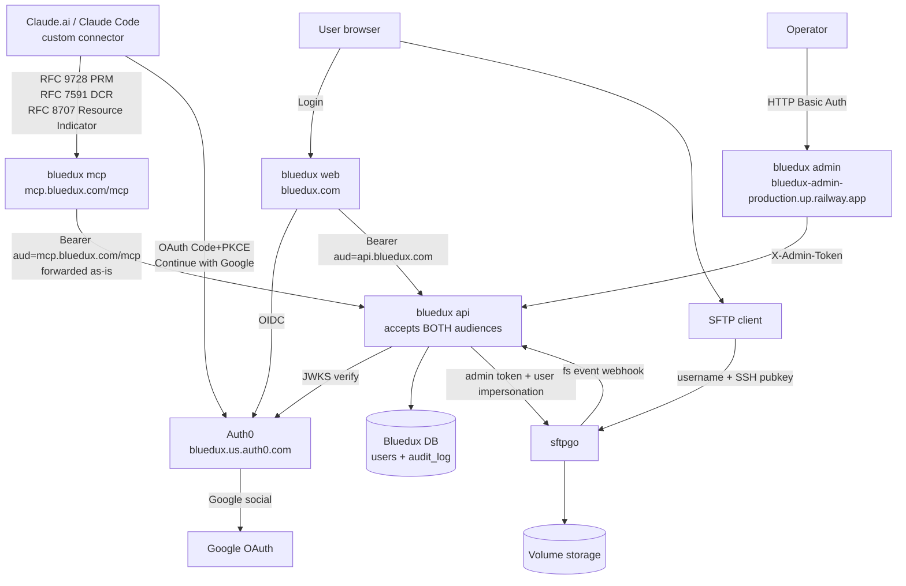

# BlueduxV2 fact sheet

> **本文件目的**：项目相对庞杂，涉及 Auth0 / 6 个 Railway service / 自建 Postgres / sftpgo / Cloudflare DNS / GCP OAuth / pnpm monorepo / Docker 多阶段构建。这份 `fact.md` + `fact/` 子目录是**唯一可信事实源**——任何决策、调试、调参之前先看这里。代码改动 / 拓扑变化 / 凭据轮换都同步更新对应文件。
>
> 凭据本身不在这里，写在仓库根的 `auth0.md`（gitignored）。

## 顶级红线（先读这 4 条）

1. **`fact.md` 是索引，分册在 `fact/`**：核心摘要 + 架构图留在本文件，细节按主题拆到 `fact/<topic>.md`（见下面索引表）。任何 patch 要让代码 + 本文件 + 对应分册三者保持一致。
2. **`RAILWAY_DOCKERFILE_PATH` 是 monorepo 多 service 的命门**：每个 Railway service 必须设这个 env var 指向自家 `apps/<name>/Dockerfile`，root dir 用 `/`，build context 是仓库根。少一个 service 的话 workspace symlink 跨包不通，build 失败。
3. **bluedux-api 接受双 audience**：`https://api.bluedux.com`（web/admin）+ `https://mcp.bluedux.com/mcp`（MCP 转发的 Claude.ai JWT）。改 audience 之前先看 `apps/api/src/middleware/auth.ts` 的 `audiences` 数组，不是只改一个 env var。
4. **Auth0 application 总数有上限**（free/dev tier ≈ 10 个）。每个 Claude.ai 用户/profile 通过 DCR 增加 1 个 third-party `Claude` application。stale client 要定期清；规模化前要么升 plan 要么部署 DCR proxy。

## 详细分册索引

| 文件 | 内容 | 何时翻 |
|---|---|---|
| [`fact/env.md`](fact/env.md) | 5 个 service 的环境变量清单 | 部署 / debug 502 / 改密钥时 |
| [`fact/auth0.md`](fact/auth0.md) | Applications / APIs / tenant 6 个开关 / Action 代码 / Google connection | 改 OAuth 流程 / 排查 401 / Claude.ai connector 报错时 |
| [`fact/flows.md`](fact/flows.md) | web / SFTP / MCP / admin 4 条端到端流程 | 理解某个调用链时 |
| [`fact/gotchas.md`](fact/gotchas.md) | 24 条历史踩坑全集 | 遇到怪现象、设计新功能前快扫一眼 |
| [`fact/checklist.md`](fact/checklist.md) | 端到端验证清单 | 每次大改后跑一遍确认没退化 |

## 整体架构



## Railway services（project: `bluedux`）

| Service | 公网 URL | 内网 DNS | 作用 |
|---|---|---|---|
| **bluedux** (web) | `https://bluedux.com` / `https://www.bluedux.com` (Cloudflare 橙云 + Railway 边缘) | `bluedux.railway.internal:8080` | Next.js 15 SSR，用户 UI（Auth0 登录、文件浏览/上传/下载、SSH key 管理） |
| **bluedux-api** | `https://bluedux-api-production.up.railway.app` | `bluedux-api.railway.internal:8080` | Hono on Node，业务 API + JWKS 校验 + sftpgo admin 调用 + sftpgo webhook 接收 + admin endpoint |
| **bluedux-mcp** | `https://mcp.bluedux.com` (CF 橙云) + `https://bluedux-mcp-production.up.railway.app` | `bluedux-mcp.railway.internal:8080` | MCP server（@modelcontextprotocol/sdk），暴露给 Claude.ai 作 custom connector。挂在自定义域名 `mcp.bluedux.com`，PRM `resource` 字段会自动跟随当前 host |
| **bluedux-admin** | `https://bluedux-admin-production.up.railway.app` | `bluedux-admin.railway.internal:3001` | 后台管理（Next.js + HTTP Basic Auth）。当前页面：`/audit` 事件、`/users` 用户列表 |
| **sftpgo** | `https://sftpgo-production-a929.up.railway.app` (admin only) + `tcp 2022` (SFTP) | `sftpgo.railway.internal` | 文件存储 + SFTP 协议；用户 webclient 已不直接暴露 |
| **Postgres** | 不公开 | `postgres.railway.internal:5432` | 两个 database：`railway`（sftpgo 用）+ `bluedux`（bluedux-api 用） |

旧孤儿 volume：`bluedux-server-volume` (`/data`) 和 `pocketbase-volume` (`/pb_data`) 在删 service 时残留，可在 Railway dashboard 删除节省费用。

## 仓库结构（pnpm monorepo）

```
BlueduxV2/
├── apps/
│   ├── web/                Next.js 15 App Router (Auth0 SDK v4) — 用户 UI
│   ├── api/                Hono on Node + Drizzle + jose JWKS — 业务 API
│   ├── mcp/                @modelcontextprotocol/sdk on Node — MCP server
│   └── admin/              Next.js + Basic Auth middleware — 后台
├── packages/
│   ├── db/                 Drizzle schema (users + audit_log) + migrations + client factory
│   └── sftpgo-client/      sftpgo HTTP API 类型化 client
├── deploy/
│   └── sftpgo-railway/     sftpgo Dockerfile + railway.json + events-webhook.json (gitignored)
├── fact.md                 (本文件 — 核心摘要 + 索引)
├── fact/                   (分册：env / auth0 / flows / gotchas / checklist)
├── auth0.md                (gitignored — Auth0 凭据 + admin password 等小抄)
└── pnpm-workspace.yaml / package.json / tsconfig.base.json
```
