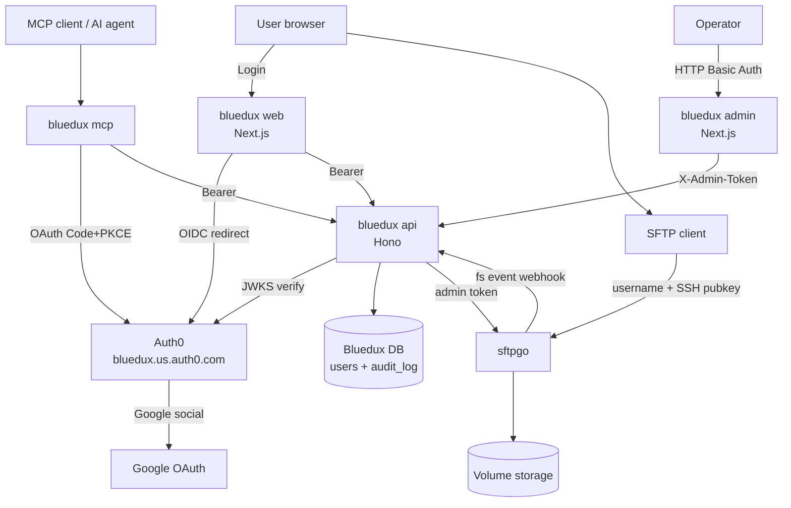

# BlueduxV2 fact sheet

> **本文件目的**：项目相对庞杂，涉及 Auth0 / 6 个 Railway service / 自建 Postgres / sftpgo / Cloudflare DNS / GCP OAuth / pnpm monorepo / Docker 多阶段构建。这份 `fact.md` 是**唯一可信事实源**——任何决策、调试、调参之前先看这里。代码改动 / 拓扑变化 / 凭据轮换都同步更新本文件。
>
> 凭据本身不在这里，写在仓库根的 `auth0.md`（gitignored）。

## 整体架构



## Railway services（project: `bluedux`）

| Service | 公网 URL | 内网 DNS | 作用 |
|---|---|---|---|
| **bluedux** (web) | `https://bluedux.com` / `https://www.bluedux.com` (Cloudflare 橙云 + Railway 边缘) | `bluedux.railway.internal:8080` | Next.js 15 SSR，用户 UI（Auth0 登录、文件浏览/上传/下载、SSH key 管理） |
| **bluedux-api** | `https://bluedux-api-production.up.railway.app` | `bluedux-api.railway.internal:8080` | Hono on Node，业务 API + JWKS 校验 + sftpgo admin 调用 + sftpgo webhook 接收 + admin endpoint |
| **bluedux-mcp** | `https://bluedux-mcp-production.up.railway.app` | `bluedux-mcp.railway.internal:8080` | MCP server（@modelcontextprotocol/sdk），给 AI agent OAuth Authorization Code+PKCE |
| **bluedux-admin** | `https://bluedux-admin-production.up.railway.app` | `bluedux-admin.railway.internal:3001` | 后台管理（Next.js + HTTP Basic Auth）。当前页面：`/audit` 事件、`/users` 用户列表 |
| **sftpgo** | `https://sftpgo-production-a929.up.railway.app` (admin only) + `tcp 2022` (SFTP) | `sftpgo.railway.internal` | 文件存储 + SFTP 协议；用户 webclient 已不直接暴露 |
| **Postgres** | 不公开 | `postgres.railway.internal:5432` | 两个 database：`railway`（sftpgo 用）+ `bluedux`（bluedux-api 用） |

旧孤儿 volume：`bluedux-server-volume` (`/data`) 和 `pocketbase-volume` (`/pb_data`) 在删 service 时残留，可在 Railway dashboard 删除节省费用。

## 环境变量清单

> 所有 service 都设了 `RAILWAY_DOCKERFILE_PATH=apps/<name>/Dockerfile`（关键：让 Railway 用对的 Dockerfile，root dir = `/`，build 上下文是仓库根）。下面省略这一项。

### bluedux (web)

| 变量 | 值（示例） | 说明 |
|---|---|---|
| `AUTH0_DOMAIN` | `bluedux.us.auth0.com` | Auth0 tenant |
| `AUTH0_CLIENT_ID` | `<bluedux web app 的 client id>` | Regular Web Application |
| `AUTH0_CLIENT_SECRET` | `<...>` | 同上 |
| `AUTH0_AUDIENCE` | `https://api.bluedux.com` | API identifier |
| `APP_BASE_URL` | `https://bluedux.com` | Auth0 SDK v4 用作 redirect_uri base |
| `AUTH0_SECRET` | `<openssl rand -hex 32>` | session cookie 加密 |
| `BLUEDUX_API_URL` | `http://bluedux-api.railway.internal:8080` | 走内网 |
| `PORT` | `8080` | Next.js standalone 监听端口 |

### bluedux-api

| 变量 | 值（示例） | 说明 |
|---|---|---|
| `AUTH0_DOMAIN` / `AUTH0_AUDIENCE` | 同 web | JWKS 校验 + audience |
| `DATABASE_URL` | `postgresql://postgres:<pwd>@postgres.railway.internal:5432/bluedux` | 注意是 `bluedux` database，不是 `railway` |
| `SFTPGO_BASE_URL` | `https://sftpgo-production-a929.up.railway.app` | 暂用公网 |
| `SFTPGO_ADMIN_USERNAME` | `admin` | MVP 暂用，**生产前换** |
| `SFTPGO_ADMIN_PASSWORD` | `noneed` | 同上 |
| `SFTPGO_USER_PASSWORD_KEY` | `<openssl rand -hex 32>` | HMAC key 派生每个用户的 sftpgo 密码 |
| `SFTPGO_WEBHOOK_TOKEN` | `<openssl rand -hex 24>` | sftpgo → api webhook 共享密钥 |
| `BLUEDUX_ADMIN_PASSWORD` | `<openssl rand -hex 16>` | admin endpoint 校验 X-Admin-Token |
| `PORT` | `8080` |  |

### bluedux-mcp

| 变量 | 值 | 说明 |
|---|---|---|
| `AUTH0_DOMAIN` / `AUTH0_AUDIENCE` | 同 api | 校验用户 Bearer |
| `BLUEDUX_API_URL` | `http://bluedux-api.railway.internal:8080` | 走内网 |
| `PORT` | `8080` |  |

### bluedux-admin

| 变量 | 值 | 说明 |
|---|---|---|
| `BLUEDUX_API_URL` | `http://bluedux-api.railway.internal:8080` | SSR 拉数据用 |
| `BLUEDUX_ADMIN_PASSWORD` | 同 api 那个 | middleware Basic Auth + 透传 X-Admin-Token |
| `PORT` | `3001` |  |

### sftpgo
（详见 `deploy/sftpgo-railway/DEPLOY.md` —— 那份是 sftpgo 单独部署的历史文档；本期改动：删了 OIDC 8 个 env vars，添加了 events-webhook event rule via loaddata）

## 仓库结构（pnpm monorepo）

```
BlueduxV2/
├── apps/
│   ├── web/                Next.js 15 App Router (Auth0 SDK v4) — 用户 UI
│   ├── api/                Hono on Node + Drizzle + jose JWKS — 业务 API
│   ├── mcp/                @modelcontextprotocol/sdk on Node — MCP server
│   └── admin/              Next.js + Basic Auth middleware — 后台
├── packages/
│   ├── db/                 Drizzle schema (users + audit_log) + migrations + client factory
│   └── sftpgo-client/      sftpgo HTTP API 类型化 client
├── deploy/
│   └── sftpgo-railway/     sftpgo Dockerfile + railway.json + 历史 DEPLOY.md（sftpgo 专属）
├── pnpm-workspace.yaml
├── package.json (root)
├── tsconfig.base.json
├── fact.md   (本文件)
└── auth0.md  (gitignored — Auth0 凭据 + admin password 等小抄)
```

## Auth0 配置摘要

Tenant: `bluedux.us.auth0.com`（US, Development）

| Auth0 资源 | 类型 | 说明 |
|---|---|---|
| Application `bluedux web` | Regular Web Application | Callback: `/auth/callback` × 3 host (localhost/bluedux.com/www.bluedux.com)。Auth0 SDK v4 自动 mount routes。**APIs tab 必须 Authorize 访问 `bluedux api`**（容易漏） |
| Application `bluedux mcp` | Native | Callback: `http://localhost`（OAuth Loopback Redirect）+ `https://mcp.bluedux.com/auth/callback`。APIs tab 同样要 Authorize `bluedux api` |
| API `bluedux api` | Custom API | Identifier (audience) `https://api.bluedux.com`，RS256。5 scopes: `read:files write:files delete:files manage:keys read:profile` |
| Connection `google-oauth2` | Social | 复用 GCP OAuth client（`449350223349-91vl1c0buo42ume2s9qmcnsf5dpm2cj2.apps.googleusercontent.com`），GCP 那边的 Authorized redirect URI 加了 `https://bluedux.us.auth0.com/login/callback` |

## 用户/客户端流程

### Web 登录
1. 用户访问 `bluedux.com` → 看登录按钮 → 点 → `/auth/login`（Auth0 SDK v4 中间件接管）
2. SDK 重定向到 `https://bluedux.us.auth0.com/authorize?...&audience=https://api.bluedux.com&scope=openid profile email read:files ...&code_challenge=...`（PKCE）
3. Auth0 → Google → 用户授权 → 回 Auth0 → 回 `/auth/callback` 带 `code`
4. SDK 用 `code` + `code_verifier` 换 access_token + id_token，写 session cookie
5. 重定向到 `/files`
6. `/files` server component 读 session，对 bluedux.api 请求 `/v1/me/provision`（首次登录）→ bluedux DB 写 user 行 + sftpgo admin 调 `POST /api/v2/users`：username=email、home_dir=`/srv/sftpgo/data/<email>`、password = HMAC-SHA256(`SFTPGO_USER_PASSWORD_KEY`, `auth0_sub`)、quota=300MB
7. 之后所有 `/files` 操作走 `/api/proxy/*` → bluedux.api（带 Bearer）→ sftpgo

### SFTP 客户端登录
1. 用户在 `/settings/ssh-key` 贴 SSH 公钥 → bluedux.api `PUT /v1/me/sshkey` → 写 bluedux DB + 调 sftpgo 更新 `public_keys`
2. 客户端 `sftp -P 2022 <email>@sftpgo-production-a929.up.railway.app`，用对应私钥 → sftpgo 校验 pubkey → 登录成功
3. 上传/下载文件触发 sftpgo Event Manager `bluedux-fs-events` → `POST http://bluedux-api.railway.internal:8080/v1/webhooks/sftpgo`（含 `X-SFTPGO-Webhook-Token`）→ bluedux DB `audit_log` 行

### MCP 客户端登录
1. AI agent（Claude Desktop 等）配置 MCP server URL: `https://bluedux-mcp-production.up.railway.app/mcp`
2. MCP client 走 OAuth Authorization Code + PKCE，浏览器跳 Auth0 (`bluedux mcp` Native app)
3. 拿到用户 access_token，每次 MCP 请求带 `Authorization: Bearer <token>`
4. bluedux-mcp JWKS 验证 → 调 bluedux.api（同样 Bearer）→ sftpgo

### Admin（运维）
1. 浏览器访问 `https://bluedux-admin-production.up.railway.app`
2. 弹 HTTP Basic Auth：username 任意，password = `BLUEDUX_ADMIN_PASSWORD`
3. middleware 校验 → 通过后 SSR 调 bluedux.api `/v1/admin/audit`（带 X-Admin-Token）→ 拿 audit_log + users
4. UI 展示 audit log 表 + users 表

## 重要事实 / 踩过的坑

1. **`RAILWAY_DOCKERFILE_PATH` 是关键**：单 monorepo 多 service，每个 service 设 env var 指向自家 Dockerfile，root dir 都用 `/`（仓库根），让 workspace symlink 跨 package 可达。
2. **`pnpm deploy --prod` 输出 self-contained 目录**：runtime 镜像直接拷这个产物。否则 lockfile 不匹配 + symlink 失效。
3. **tsup `noExternal: [/^@bluedux\//]`**：把 workspace 包内联进 bundle，否则 runtime 会尝试 import `.ts` 源码（Node 22 不支持 node_modules 里 strip TS types）。
4. **Auth0 access_token 不含 email/name claim**：profile claims 在 id_token 或 `/userinfo` endpoint。`bluedux-api` 的 provision 流程必须调 `https://${AUTH0_DOMAIN}/userinfo` with Bearer 拿 email。
5. **Auth0 web app 必须 Authorize `bluedux api`**：默认是 OFF，登录会以 `Client xxx is not authorized to access resource server` 失败。
6. **Auth0 SDK v4 路由是 `/auth/login`**：不是 v3 的 `/api/auth/login`。
7. **sftpgo username = email**：`@`、`.` 在 Linux 文件名合法。sftpgo 默认 `naming_rules` 允许 email。
8. **sftpgo password 派生**：HMAC-SHA256(env key, auth0_sub)，不存库、不下发；用户视角永远不知道这个密码。SSO 完成 + SSH key 上传后，bluedux-api 用这个派生密码做 sftpgo HTTP API user-context login。
9. **Railway internal DNS**：`<service>.railway.internal` 同 project 同 environment 内可达，免出网费 + 更快。
10. **GCP OAuth client 共用**：原 sftpgo OIDC 用的 GCP OAuth client 现在被 Auth0 复用，redirect URI 加了 Auth0 那条；JavaScript origins **不要**加 callback URL（那是给 SPA 用的）。
11. **Cloudflare 橙云 OK**：之前担心 CF cert 与 Railway cert 冲突，实测 SSL/TLS = Full (strict) 模式下两层 TLS 没问题；橙云顺带 CDN/DDoS。
12. **sftpgo Volume 文件持久**：删用户账号不删 home_dir 文件；重建同名用户会复用旧目录（功能/bug 双面）。
13. **sftpgo Event Manager rule 通过 `loaddata` 一次性 import**：`events-webhook.json` 不入仓库（gitignored，含 webhook secret），文档里描述清结构，import 后规则在 Postgres 里活到永远。

## 验证清单

- [ ] `https://bluedux.com` 显示 Welcome + Sign in with Google 按钮
- [ ] 点击登录 → 跳 Auth0 → Google 授权 → 跳回 `/files` 列表（首次会自动 provision）
- [ ] `/settings/ssh-key` 贴公钥 → 保存
- [ ] `sftp -P 2022 <email>@sftpgo-production-a929.up.railway.app` 用对应私钥能登
- [ ] web 上传文件 → SFTP 能看到
- [ ] SFTP 上传文件 → web 能看到 → admin `/audit` 有新 row
- [ ] MCP Inspector / Claude Desktop 连 `https://bluedux-mcp-production.up.railway.app/mcp` → OAuth → list_files
- [ ] `https://bluedux-admin-production.up.railway.app` Basic Auth 进入 → 看到 audit + users
