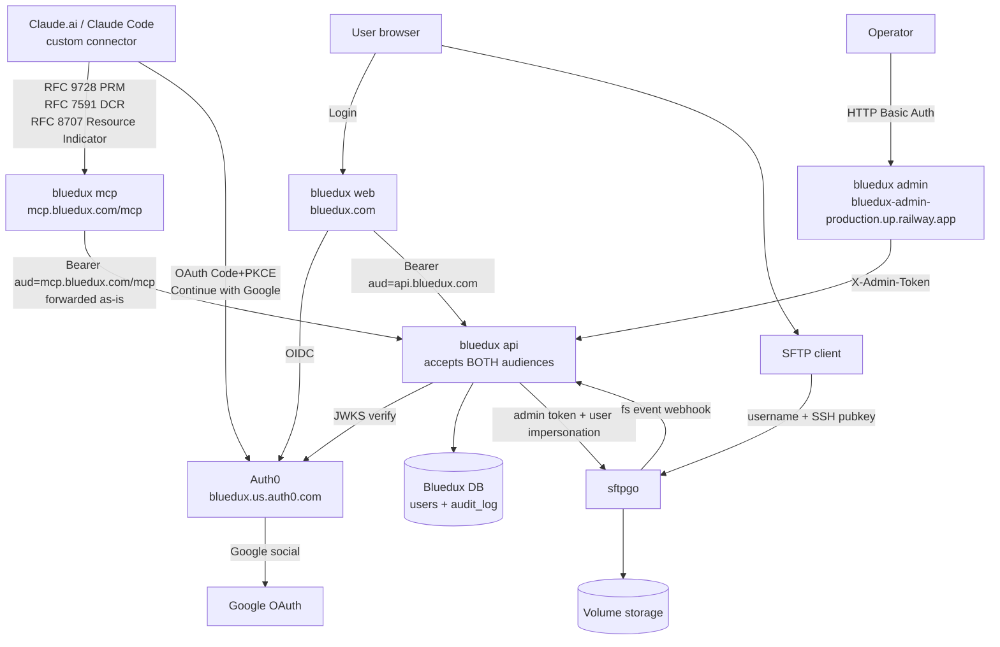

# BlueduxV2 fact sheet

> **本文件目的**：项目相对庞杂，涉及 Auth0 / 6 个 Railway service / 自建 Postgres / sftpgo / Cloudflare DNS / GCP OAuth / pnpm monorepo / Docker 多阶段构建。这份 `fact.md` 是**唯一可信事实源**——任何决策、调试、调参之前先看这里。代码改动 / 拓扑变化 / 凭据轮换都同步更新本文件。
>
> 凭据本身不在这里，写在仓库根的 `auth0.md`（gitignored）。

## 整体架构



## Railway services（project: `bluedux`）

| Service | 公网 URL | 内网 DNS | 作用 |
|---|---|---|---|
| **bluedux** (web) | `https://bluedux.com` / `https://www.bluedux.com` (Cloudflare 橙云 + Railway 边缘) | `bluedux.railway.internal:8080` | Next.js 15 SSR，用户 UI（Auth0 登录、文件浏览/上传/下载、SSH key 管理） |
| **bluedux-api** | `https://bluedux-api-production.up.railway.app` | `bluedux-api.railway.internal:8080` | Hono on Node，业务 API + JWKS 校验 + sftpgo admin 调用 + sftpgo webhook 接收 + admin endpoint |
| **bluedux-mcp** | `https://mcp.bluedux.com` (CF 橙云) + `https://bluedux-mcp-production.up.railway.app` | `bluedux-mcp.railway.internal:8080` | MCP server（@modelcontextprotocol/sdk），暴露给 Claude.ai 作 custom connector。挂在自定义域名 `mcp.bluedux.com`，PRM `resource` 字段会自动跟随当前 host |
| **bluedux-admin** | `https://bluedux-admin-production.up.railway.app` | `bluedux-admin.railway.internal:3001` | 后台管理（Next.js + HTTP Basic Auth）。当前页面：`/audit` 事件、`/users` 用户列表 |
| **sftpgo** | `https://sftpgo-production-a929.up.railway.app` (admin only) + `tcp 2022` (SFTP) | `sftpgo.railway.internal` | 文件存储 + SFTP 协议；用户 webclient 已不直接暴露 |
| **Postgres** | 不公开 | `postgres.railway.internal:5432` | 两个 database：`railway`（sftpgo 用）+ `bluedux`（bluedux-api 用） |

旧孤儿 volume：`bluedux-server-volume` (`/data`) 和 `pocketbase-volume` (`/pb_data`) 在删 service 时残留，可在 Railway dashboard 删除节省费用。

## 环境变量清单

> 所有 service 都设了 `RAILWAY_DOCKERFILE_PATH=apps/<name>/Dockerfile`（关键：让 Railway 用对的 Dockerfile，root dir = `/`，build 上下文是仓库根）。下面省略这一项。

### bluedux (web)

| 变量 | 值（示例） | 说明 |
|---|---|---|
| `AUTH0_DOMAIN` | `bluedux.us.auth0.com` | Auth0 tenant |
| `AUTH0_CLIENT_ID` | `<bluedux web app 的 client id>` | Regular Web Application |
| `AUTH0_CLIENT_SECRET` | `<...>` | 同上 |
| `AUTH0_AUDIENCE` | `https://api.bluedux.com` | API identifier |
| `APP_BASE_URL` | `https://bluedux.com` | Auth0 SDK v4 用作 redirect_uri base |
| `AUTH0_SECRET` | `<openssl rand -hex 32>` | session cookie 加密 |
| `BLUEDUX_API_URL` | `http://bluedux-api.railway.internal:8080` | 走内网 |
| `PORT` | `8080` | Next.js standalone 监听端口 |

### bluedux-api

| 变量 | 值（示例） | 说明 |
|---|---|---|
| `AUTH0_DOMAIN` | `bluedux.us.auth0.com` | JWKS 校验 |
| `AUTH0_AUDIENCE` | `https://api.bluedux.com` | 主 audience；middleware 实际接受**两个** audience（见下） |
| `DATABASE_URL` | `postgresql://postgres:<pwd>@postgres.railway.internal:5432/bluedux` | 注意是 `bluedux` database，不是 `railway` |
| `SFTPGO_BASE_URL` | `https://sftpgo-production-a929.up.railway.app` | 暂用公网 |
| `SFTPGO_ADMIN_USERNAME` | `admin` | MVP 暂用，**生产前换** |
| `SFTPGO_ADMIN_PASSWORD` | `noneed` | 同上 |
| `SFTPGO_USER_PASSWORD_KEY` | `<openssl rand -hex 32>` | HMAC key 派生每个用户的 sftpgo 密码 |
| `SFTPGO_WEBHOOK_TOKEN` | `<openssl rand -hex 24>` | sftpgo → api webhook 共享密钥 |
| `BLUEDUX_ADMIN_PASSWORD` | `<openssl rand -hex 16>` | admin endpoint 校验 X-Admin-Token |
| `PORT` | `8080` |  |

### bluedux-mcp

| 变量 | 值 | 说明 |
|---|---|---|
| `AUTH0_DOMAIN` | `bluedux.us.auth0.com` |  |
| `AUTH0_AUDIENCE` | `https://mcp.bluedux.com/mcp` | **不是** `api.bluedux.com`——MCP 自己有独立 audience，bluedux.api 兼容两个 |
| `BLUEDUX_API_URL` | `http://bluedux-api.railway.internal:8080` | 走内网 |
| `PORT` | `8080` |  |

**bluedux.api 的双 audience 接受**：`apps/api/src/middleware/auth.ts` 里 `audiences = [env.AUTH0_AUDIENCE, 'https://mcp.bluedux.com/mcp']`，jose `jwtVerify` 接受数组（任一匹配即通过）。原因：MCP server 把用户 JWT 原封不动转发给 api，api 必须能验那个 JWT。Web/admin 各自的 token 不受影响。

### bluedux-admin

| 变量 | 值 | 说明 |
|---|---|---|
| `BLUEDUX_API_URL` | `http://bluedux-api.railway.internal:8080` | SSR 拉数据用 |
| `BLUEDUX_ADMIN_PASSWORD` | 同 api 那个 | middleware Basic Auth + 透传 X-Admin-Token |
| `PORT` | `3001` |  |

### sftpgo
镜像构建：`deploy/sftpgo-railway/Dockerfile`（基于 `drakkan/sftpgo:alpine`，`USER 0:0`，启动时 `chmod 0777 /srv/sftpgo/data`）。Railway 用 `deploy/sftpgo-railway/railway.json` 指定 builder。

关键 env vars：
- `SFTPGO_DATA_PROVIDER__*` 系列：连 Postgres `railway` database
- `SFTPGO_DATA_PROVIDER__USERS_BASE_DIR=/srv/sftpgo/data`、`BACKUPS_PATH=/srv/sftpgo/data/backups`
- `SFTPGO_HTTPD__BINDINGS__0__CLIENT_IP_PROXY_HEADER=X-Forwarded-For`、`PROXY_ALLOWED=0.0.0.0/0,::/0`、`PROXY_MODE=0`、`SFTPGO_HTTPD__TOKEN_VALIDATION=1`（关掉 JWT 跟 IP 绑定，否则 Railway 反代换 IP 后所有 token 失效）
- 默认 admin：`SFTPGO_DEFAULT_ADMIN_USERNAME=admin` / `SFTPGO_DEFAULT_ADMIN_PASSWORD=noneed`（MVP，**生产前换**）
- **不再有** OIDC env vars（migration 时全部删了，现在所有用户认证由 bluedux web/mcp 走 Auth0 完成，sftpgo 只看用户名密码 + SSH key）

Event Manager rule（sftpgo → bluedux.api fs event webhook）：通过 `deploy/sftpgo-railway/events-webhook.json` 一次性 `POST /api/v2/loaddata?mode=0` 导入到 Postgres，规则永久生效。文件 gitignored（含 webhook secret），现场重建时按 `apps/api/src/routes/webhooks.ts` 期望的 payload shape 配。

## 仓库结构（pnpm monorepo）

```
BlueduxV2/
├── apps/
│   ├── web/                Next.js 15 App Router (Auth0 SDK v4) — 用户 UI
│   ├── api/                Hono on Node + Drizzle + jose JWKS — 业务 API
│   ├── mcp/                @modelcontextprotocol/sdk on Node — MCP server
│   └── admin/              Next.js + Basic Auth middleware — 后台
├── packages/
│   ├── db/                 Drizzle schema (users + audit_log) + migrations + client factory
│   └── sftpgo-client/      sftpgo HTTP API 类型化 client
├── deploy/
│   └── sftpgo-railway/     sftpgo Dockerfile + railway.json + 历史 DEPLOY.md（sftpgo 专属）
├── pnpm-workspace.yaml
├── package.json (root)
├── tsconfig.base.json
├── fact.md   (本文件)
└── auth0.md  (gitignored — Auth0 凭据 + admin password 等小抄)
```

## Auth0 配置摘要

Tenant: `bluedux.us.auth0.com`（US, Development tier）

### Applications

| 名字 | 类型 | 用途 / 说明 |
|---|---|---|
| `bluedux web` | Regular Web Application | Callback: `/auth/callback` × 3 host。Auth0 SDK v4 自动 mount。**APIs tab 必须 Authorize `bluedux api`**（默认 OFF） |
| `bluedux mcp` | Native | 历史遗留（最初规划 Claude Desktop 用的静态 client）。**Claude.ai connector 流程不用它**——Claude.ai 走 DCR 动态注册，每个用户/profile 自动产生一个 third-party `Claude` Generic application |
| `Claude` × N | Generic (Third-Party) | 每个 Claude.ai 用户/profile 通过 DCR 注册一个，client_id 形如 `tpc_xxxxxxx`。受 Auth0 application 总数上限约束（见踩坑） |

### APIs（resource servers）

| 名字 | Identifier (audience) | 用途 |
|---|---|---|
| `bluedux api` | `https://api.bluedux.com` | web/admin 流程的主 audience。Scopes: `read:files write:files delete:files manage:keys read:profile`。RS256 |
| `bluedux mcp` | `https://mcp.bluedux.com/mcp` | Claude.ai connector 流程的 audience。**Identifier 必须等于 PRM `resource` 字段**（Auth0 用它做 `resource=` 参数 lookup）。Scopes: `read:files write:files delete:files`。Allow Offline Access = ON。RS256 |

### Tenant-wide 设置（让 Claude.ai DCR + Google SSO 跑通）

按层级影响从大到小：

1. **Settings → Advanced → "Dynamic Client Registration (DCR)" = ON**：让 Claude.ai 能自动 POST `/oidc/register`
2. **Settings → Advanced → "Enable Application Connections" = ON**：新注册的 application 自动启用所有 enabled connection（不勾的话 DCR client 没 Google connection 用，会 `no connections enabled for the client`）
3. **Settings → Advanced → "Resource Parameter Compatibility Profile" = ON**：让 Auth0 接受 `resource=` 参数（RFC 8707），不光 `audience=`
4. **Settings → General → "API Authorization Settings" → Default Audience = `https://api.bluedux.com`**：保险默认值
5. **Authentication → Social → Google → Settings tab → "Promote Connection to Domain Level" = ON**：让 third-party (DCR) application 也能用 Google connection。**不开**这个开关，DCR client toggle Google 时报 "Unexpected failure trying to update the connection"，登录走不通
6. **API `bluedux mcp` → Settings → "Default Permissions for Third Party Apps"**：User Access + Client Access 都设为 **Authorized** 并勾选 3 个 scope (read:files / write:files / delete:files)。这就是给所有 DCR third-party client 默认授权 MCP API 的开关——免去逐个 client 手动 Authorize

### Action `inject-mcp-scopes`（Post Login）

```javascript
exports.onExecutePostLogin = async (event, api) => {
  const aud = event.resource_server?.identifier;
  if (aud !== 'https://api.bluedux.com' && aud !== 'https://mcp.bluedux.com/mcp') return;
  const requested = (event.transaction?.requested_scopes ?? []);
  for (const s of ['openid', 'profile', 'email', 'read:files', 'write:files', 'delete:files']) {
    if (requested.includes(s)) api.accessToken.addScope(s);
  }
  // Identity claims for first-touch provisioning (no /userinfo round-trip)
  if (event.user.email) api.accessToken.setCustomClaim('https://bluedux.com/email', event.user.email);
  if (event.user.name)  api.accessToken.setCustomClaim('https://bluedux.com/name',  event.user.name);
};
```

干两件事：
- 显式把请求里的 scope 注入 access token——Auth0 调用 `addScope()` 后会进入"白名单模式"，**没显式 add 的 scope 全部从 token 里消失**，所以连 OIDC 标准 scope 都要列在白名单里
- 把 `email` / `name` 作为 namespaced custom claim 注入 token——bluedux.api 的 `requireAuth` 直接从 JWT 读，不用打 Auth0 `/userinfo`（Claude.ai 不传 `openid` scope，`/userinfo` 必拒）

### Google Social Connection
复用 GCP OAuth client `449350223349-91vl1c0buo42ume2s9qmcnsf5dpm2cj2.apps.googleusercontent.com`。GCP 的 Authorized redirect URI 含 `https://bluedux.us.auth0.com/login/callback`。"Promote Connection to Domain Level" 必开（见上）。

## 用户/客户端流程

### Web 登录
1. 用户访问 `bluedux.com` → 看登录按钮 → 点 → `/auth/login`（Auth0 SDK v4 中间件接管）
2. SDK 重定向到 `https://bluedux.us.auth0.com/authorize?...&audience=https://api.bluedux.com&scope=openid profile email read:files ...&code_challenge=...`（PKCE）
3. Auth0 → Google → 用户授权 → 回 Auth0 → 回 `/auth/callback` 带 `code`
4. SDK 用 `code` + `code_verifier` 换 access_token + id_token，写 session cookie
5. 重定向到 `/files`
6. `/files` server component 读 session，对 bluedux.api 请求 `/v1/me/provision`（首次登录）→ bluedux DB 写 user 行 + sftpgo admin 调 `POST /api/v2/users`：username=email、home_dir=`/srv/sftpgo/data/<email>`、password = HMAC-SHA256(`SFTPGO_USER_PASSWORD_KEY`, `auth0_sub`)、quota=300MB
7. 之后所有 `/files` 操作走 `/api/proxy/*` → bluedux.api（带 Bearer）→ sftpgo

### SFTP 客户端登录
1. 用户在 `/settings/ssh-key` 贴 SSH 公钥 → bluedux.api `PUT /v1/me/sshkey` → 写 bluedux DB + 调 sftpgo 更新 `public_keys`
2. 客户端 `sftp -P 2022 <email>@sftpgo-production-a929.up.railway.app`，用对应私钥 → sftpgo 校验 pubkey → 登录成功
3. 上传/下载文件触发 sftpgo Event Manager `bluedux-fs-events` → `POST http://bluedux-api.railway.internal:8080/v1/webhooks/sftpgo`（含 `X-SFTPGO-Webhook-Token`）→ bluedux DB `audit_log` 行

### MCP 客户端登录（Claude.ai / Claude Code custom connector）— 主路径

**用户视角**：Claude.ai → Settings → Connectors → Add custom connector → URL `https://mcp.bluedux.com/mcp` → Connect → 弹 Auth0 同意页 → Accept → 完成。所有工具 (`list_files / read_file / write_file / delete_file`) 立刻在聊天里可用。

**协议视角**（这套已经在生产环境跑通）：

1. Claude.ai POST `/mcp` 无 token → MCP 返回 **401** + `WWW-Authenticate: Bearer realm="bluedux.mcp", error="invalid_token", resource_metadata="https://mcp.bluedux.com/.well-known/oauth-protected-resource/mcp"`（CORS 头同时附上）
2. Claude.ai GET `/.well-known/oauth-protected-resource/mcp` → 收到 PRM：
   ```json
   {
     "resource": "https://mcp.bluedux.com/mcp",
     "authorization_servers": ["https://bluedux.us.auth0.com"],
     "scopes_supported": ["openid","profile","email","read:files","write:files","delete:files"],
     "bearer_methods_supported": ["header"]
   }
   ```
3. Claude.ai GET `https://bluedux.us.auth0.com/.well-known/openid-configuration` → 拿到 `registration_endpoint=/oidc/register`、`authorization_endpoint=/authorize`、`token_endpoint=/oauth/token`、`jwks_uri`
4. Claude.ai POST `/oidc/register`（DCR / RFC 7591）→ Auth0 创建一个 third-party `Claude` Generic application，返回 `tpc_xxxxx` client_id。**Auth0 application 总数 +1**（受 tenant 上限约束）
5. Claude.ai 弹浏览器 → `https://bluedux.us.auth0.com/authorize?client_id=tpc_xxx&redirect_uri=https://claude.ai/api/mcp/auth_callback&response_type=code&code_challenge=...&scope=read:files+write:files+delete:files+offline_access&resource=https://mcp.bluedux.com/mcp&prompt=consent`（注意 Claude.ai 主动**过滤掉了** OIDC scope，PRM 里 advertise 也没用——所以才需要 Action 注 custom claim）
6. Auth0：找到 `bluedux mcp` API（identifier 匹配 `resource`）→ 检查 grant（"Default Permissions for Third Party Apps" 已默认授权）→ 显示同意页 → 用户点 Continue with Google → Google → 回 Auth0 → 重定向回 Claude.ai 带 `code`
7. Claude.ai POST `/oauth/token` 用 PKCE verifier 换 access_token：
   - `aud=https://mcp.bluedux.com/mcp`
   - `scope=read:files write:files delete:files openid profile email offline_access`（Action 已加 OIDC scope 进白名单）
   - 含 custom claim `https://bluedux.com/email` 和 `https://bluedux.com/name`
8. 之后 Claude.ai 每次 POST `/mcp` 带 `Authorization: Bearer <jwt>`：
   - bluedux-mcp `verifyBearer` 校验 `aud=https://mcp.bluedux.com/mcp` ✓
   - MCP `ensureProvisioned()` 调 bluedux.api `/v1/me` → 404 → `/v1/me/provision`
   - api `requireAuth` 校验 `aud ∈ {api.bluedux.com, mcp.bluedux.com/mcp}` ✓
   - api 从 JWT 直接读 `email` / `name` custom claim → upsert `users` 行 → sftpgo `POST /api/v2/users` 建账号（home_dir=`/srv/sftpgo/data/<email>`，密码 = HMAC-SHA256(`SFTPGO_USER_PASSWORD_KEY`, `auth0_sub`)）
   - MCP 工具调用走通

**第一次接入也是这条路**：用户从来没在 bluedux web 注册过没关系——first-touch provision 在第 8 步自动建账号。同样适用于 admin 删用户后再连接：sftpgo 账号 + db 行重建，文件不残留（admin 删用户时 purge 已 wipe）。

### Admin（运维）
1. 浏览器访问 `https://bluedux-admin-production.up.railway.app`
2. 弹 HTTP Basic Auth：username 任意，password = `BLUEDUX_ADMIN_PASSWORD`
3. middleware 校验 → 通过后 SSR 调 bluedux.api `/v1/admin/audit`（带 X-Admin-Token）→ 拿 audit_log + users
4. UI 展示：
   - `/audit` — audit_log 列表
   - `/users` — users 列表，每行带 **Delete** 按钮（confirm dialog → DELETE `/v1/admin/users/:id`）
5. 删用户做的事：
   - 用 `auth0_sub` 重算 sftpgo 密码 → user-token 登入 → 遍历 `/` 下所有 entry → `DELETE /api/v2/user/dirs?path=/<name>`（sftpgo 内部 `RemoveAll`，递归）→ 文件全清
   - sftpgo `DELETE /api/v2/users/<username>` → 用户记录删除
   - bluedux DB：`DELETE FROM audit_log WHERE user_id = $1` → `DELETE FROM users WHERE id = $1`
   - **不动** Auth0 那边的用户身份（同 sub 再连接会触发 first-touch provision 重建）

## 重要事实 / 踩过的坑

1. **`RAILWAY_DOCKERFILE_PATH` 是关键**：单 monorepo 多 service，每个 service 设 env var 指向自家 Dockerfile，root dir 都用 `/`（仓库根），让 workspace symlink 跨 package 可达。
2. **`pnpm deploy --prod` 输出 self-contained 目录**：runtime 镜像直接拷这个产物。否则 lockfile 不匹配 + symlink 失效。
3. **tsup `noExternal: [/^@bluedux\//]`**：把 workspace 包内联进 bundle，否则 runtime 会尝试 import `.ts` 源码（Node 22 不支持 node_modules 里 strip TS types）。
4. **Auth0 access_token 不含 email/name claim**：profile claims 在 id_token 或 `/userinfo` endpoint。`bluedux-api` 的 provision 流程必须调 `https://${AUTH0_DOMAIN}/userinfo` with Bearer 拿 email。
5. **Auth0 web app 必须 Authorize `bluedux api`**：默认是 OFF，登录会以 `Client xxx is not authorized to access resource server` 失败。
6. **Auth0 SDK v4 路由是 `/auth/login`**：不是 v3 的 `/api/auth/login`。
7. **sftpgo username = email**：`@`、`.` 在 Linux 文件名合法。sftpgo 默认 `naming_rules` 允许 email。
8. **sftpgo password 派生**：HMAC-SHA256(env key, auth0_sub)，不存库、不下发；用户视角永远不知道这个密码。SSO 完成 + SSH key 上传后，bluedux-api 用这个派生密码做 sftpgo HTTP API user-context login。
9. **Railway internal DNS**：`<service>.railway.internal` 同 project 同 environment 内可达，免出网费 + 更快。
10. **GCP OAuth client 共用**：原 sftpgo OIDC 用的 GCP OAuth client 现在被 Auth0 复用，redirect URI 加了 Auth0 那条；JavaScript origins **不要**加 callback URL（那是给 SPA 用的）。
11. **Cloudflare 橙云 OK**：之前担心 CF cert 与 Railway cert 冲突，实测 SSL/TLS = Full (strict) 模式下两层 TLS 没问题；橙云顺带 CDN/DDoS。
12. **sftpgo Volume 文件持久**：删用户账号不删 home_dir 文件；重建同名用户会复用旧目录（功能/bug 双面）。
13. **sftpgo Event Manager rule 通过 `loaddata` 一次性 import**：`events-webhook.json` 不入仓库（gitignored，含 webhook secret），文档里描述清结构，import 后规则在 Postgres 里活到永远。
14. **PRM endpoint 路径是 `/.well-known/oauth-protected-resource/mcp`**（路径段后缀跟 resource 路径，RFC 9728），不是根路径 `/.well-known/oauth-protected-resource`。MCP TS SDK 的 `getOAuthProtectedResourceMetadataUrl()` 严格按这个规则拼。
15. **PRM `resource` 必须等于 MCP server 自己的 origin URL**（当前是 `https://mcp.bluedux.com/mcp`），**不能**为了图省事写成 audience。MCP SDK 的 `checkResourceAllowed()` 按 `requested.origin === configured.origin && requestedPath.startsWith(configuredPath)` 校验。
16. **MCP 自己的 audience 跟 api 的 audience 不同**：`bluedux mcp` API identifier = `https://mcp.bluedux.com/mcp`，`bluedux api` identifier = `https://api.bluedux.com`。Claude.ai 走 RFC 8707 `resource=` → Auth0 找匹配 API → 签 `aud=resource`。**bluedux.api 的 middleware 接受两个 audience**（`apps/api/src/middleware/auth.ts` 的 `audiences` 数组），因为 MCP server 把同一个 JWT 转发给 api。
17. **Auth0 application 总数有上限**（free/dev tier 约 10 个）。每个 Claude.ai 用户/profile 通过 DCR 增加 1 个 third-party `Claude` application。需要定期手动清理或者写 Auth0 Management API 自动 GC stale DCR client。规模化前要么升级 plan 要么部署 DCR proxy。
18. **DCR client 默认是 third-party**——很多权限默认禁。三个开关必须打开：
    - `Settings → Advanced → Enable Application Connections`（让新 application 自动有 connection）
    - `Authentication → Social → Google → Settings → Promote Connection to Domain Level`（third-party 也能用 Google）
    - `bluedux mcp API → Settings → Default Permissions for Third Party Apps`（默认授权 3 个 scope，跳过逐个 client 手动 Authorize）
19. **Auth0 Action `addScope()` 进入"白名单模式"**：调一次后 access token 里**只剩**显式 add 的 scope。即使是 OIDC 标准 scope（`openid` / `profile` / `email`）也会被吞掉——所以白名单要全列。
20. **Claude.ai connector 流程会过滤掉 OIDC scope**：即使 PRM advertise `openid profile email`，Claude.ai 在 `/authorize` 也只传 `read:files write:files delete:files offline_access`。结果 token 没 openid → Auth0 `/userinfo` 必拒。**workaround**：用 Auth0 Action 把 `email` / `name` 注入成 namespaced custom claim（`https://bluedux.com/email`），bluedux.api 直接从 JWT 读，绕开 `/userinfo`。
21. **CORS 必须**：Claude.ai web 浏览器会发 OPTIONS preflight。MCP server 必须返回 204 + `Access-Control-Allow-{Origin,Methods,Headers}` + `Access-Control-Expose-Headers: WWW-Authenticate`（让 client 能读到 challenge 里的 `resource_metadata=`）。少这一步，浏览器拦下真请求，Claude.ai 报 "Couldn't reach the MCP server"。
22. **Railway `redeploy` ≠ 拉新 git**：`railway redeploy` 重跑上一次的镜像（不重新 build）。要让最新 commit 进生产用 `railway up --service <name> --detach`（基于本地 git tree 做 fresh build + push）。
23. **sftpgo `DELETE /api/v2/users/<u>` 不删 home_dir 文件**：volume 上的文件还在，重建同名用户会复用旧目录（quota 也是脏的）。Admin 删用户必须先以用户身份 purge——具体是 `DELETE /api/v2/user/dirs?path=<entry>`（sftpgo 内部 `RemoveAll`，递归处理文件 + 目录），然后再删账号。
24. **sftpgo `mode` 字段是 Go `os.FileMode` 不是 POSIX `mode_t`**：dir 标志位是 bit 31 (`0x80000000`)，不是 Unix `S_IFDIR (0o40000)`。同时 `size` 字段对非 regular file（目录、symlink）**根本不返回**（看 sftpgo `api_utils.go:319` 只在 `IsRegular()` 时才写）。client 端 isDir 必须用 `mode & 0x80000000`，size 必须 `?? 0`。

## 验证清单

- [ ] `https://bluedux.com` 显示 Welcome + Sign in with Google 按钮
- [ ] 点击登录 → 跳 Auth0 → Google 授权 → 跳回 `/files` 列表（首次会自动 provision）
- [ ] `/settings/ssh-key` 贴公钥 → 保存
- [ ] `sftp -P 2022 <email>@sftpgo-production-a929.up.railway.app` 用对应私钥能登
- [ ] web 上传文件 → SFTP 能看到
- [ ] SFTP 上传文件 → web 能看到 → admin `/audit` 有新 row
- [ ] **Claude.ai → Settings → Connectors → Add custom connector → URL `https://mcp.bluedux.com/mcp` → Connect → Continue with Google → 进入 connector，4 个工具可用**
- [ ] 全新 Google 账户（在 bluedux 没注册过）走上面这条 → 自动 first-touch provision，admin `/users` 看到新行
- [ ] admin `/users` 点 Delete → sftpgo 文件被清 + 账号删除 + db 行删除
- [ ] 同一 Google 账户再 Connect → 重新 provision，home dir 是空的
- [ ] `https://bluedux-admin-production.up.railway.app` Basic Auth 进入 → 看到 audit + users + Delete 按钮
